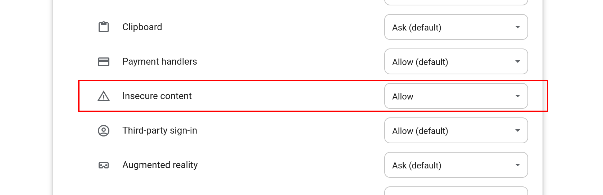

# zashboard

## Tips
1. Both PC and mobile devices can toggle the sidebar/menu to a collapsed state. After collapsing, the control widgets will be displayed within the main page.  
2. The connection page has two layout styles: cards and customizable tables. It is recommended to use tables on PC and cards on mobile devices.  
3. Quick filtering allows one-click exclusion of connections matching proxy chains, host, or destination IPs using regular expressions.  
4. Using Docker
```
docker run -d -p 80:80 ghcr.io/zephyruso/zashboard:latest
```
5. GitHub Pages no longer allows disabling HTTPS. If you are using the https://zephyruso.github.io/ and the backend IP you are accessing is not local, please set your browser to allow insecure content for the https://zephyruso.github.io/.


## 提示
1. PC 和移动设备均可切换侧边栏/菜单至折叠状态。折叠后，控制小组件将显示在主页面内。  
2. 连接页面有两种布局样式：卡片和可自定义表格。建议在 PC 上使用表格，在移动设备上使用卡片。  
3. 快速筛选使用正则表达式进行匹配，支持一键排除符合代理链、主机或目标 IP 的连接。
4. 使用Docker
```
docker run -d -p 80:80 ghcr.io/zephyruso/zashboard:latest
```
5. GitHub Pages现在不允许关闭https，如果你使用在线面板并且访问的后端IP不是本机，请将浏览器中在线面板的不安全的内容设置为允许。

