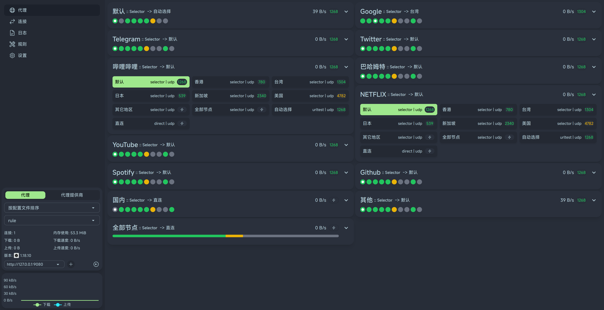

# zashboard

1. For localhost|127.0.0.1: https://board.zash.run.place
2. For others like router in LAN: http://board.zash.run.place



## Tips

1. Toggleable single-column/double-column card layout for mobile.
2. The connection page has two layout styles: cards and customizable tables. It is recommended to use tables on PC and cards on mobile devices.
3. There are many customizable options in the panel settings, be sure to check them out.
4. Using Docker

```
docker run -d -p 80:80 ghcr.io/zephyruso/zashboard:latest
```

## 提示

1. 移动端可切换单列/双列卡片布局
2. 连接页面有两种布局样式：卡片和可自定义表格。建议在 PC 上使用表格，在移动设备上使用卡片。
3. 在面板设置中有很多可自定义的选项，请务必去看看
4. 使用Docker

```
docker run -d -p 80:80 ghcr.io/zephyruso/zashboard:latest
```
