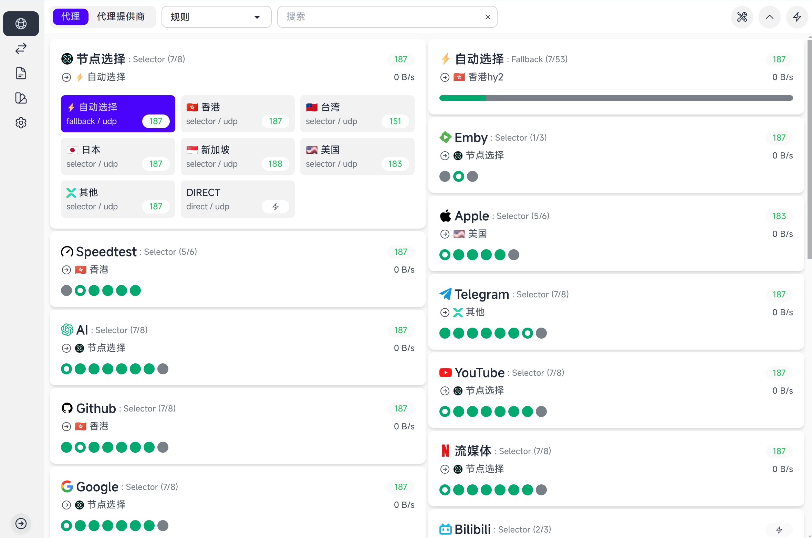
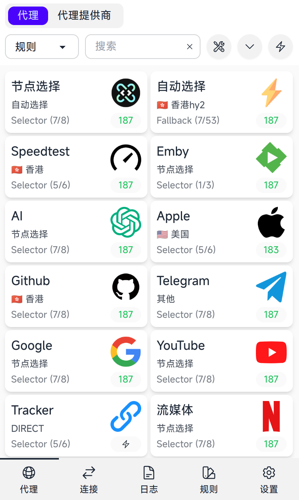

# zashboard

   

## **Online**
You can access the online zashboard at the following link:
- [Online zashboard](http://board.zash.run.place)

## **Download**
For **Mihomo** users:
The **Upgrade Dashboard** function utilizes the API from Mihomo core. Ensure you set the [configuration URL](https://wiki.metacubex.one/config/general/#_9) to the zashboard's URL.

You can download the zashboard files here:
- [dist.zip (7.64MB)](https://github.com/Zephyruso/zashboard/releases/latest/download/dist.zip) – Includes better font-loading experience.
- [dist-cdn-fonts.zip (1.27MB)](https://github.com/Zephyruso/zashboard/releases/latest/download/dist-cdn-fonts.zip) – Optimized for devices with limited storage.

## **Docker Setup**
To run zashboard via Docker, use the following command:

```
docker run -d -p 80:80 ghcr.io/zephyruso/zashboard:latest
```

## Tips

1. The connection page has two layout styles: customizable cards and customizable tables. It is recommended to use tables on PC and cards on mobile devices.
2. Click on connection row / card will display the details of connection.
3. Right-clicking on a node / node group card will perform a speedtest for the node / node group.

## 提示

1. 连接页面有两种布局样式：可自定义卡片和可自定义表格。建议在 PC 上使用表格，在移动设备上使用卡片。
2. 点击整个连接行/卡片可显示连接详情。
3. 右键点击节点/节点组卡片可对节点/节点组进行测速。

## URL params format

#### basic example
http://host:port/#/setup?hostname=ipordomain&port=9090&secret=123456

1. **`http` / `https`**

   - Determines the protocol (`http` or `https`).
   - Default: current page protocol

2. **`hostname`**

   - The Clash API's IP or domain.

3. **`port`**

   - The Clash API port.

4. **`secondaryPath`**

   - Optional path appended to the base URL.
   - Default: An empty string.

5. **`secret`**
   - Password for authentication.

6. **`disableUpgradeCore`**
   - Set '1' or 'true' to hide upgrade core button

### I code just for fun, not for money. If you really want to donate, please consider donating to [UNICEF](https://www.unicef.org/) to help hungry children.